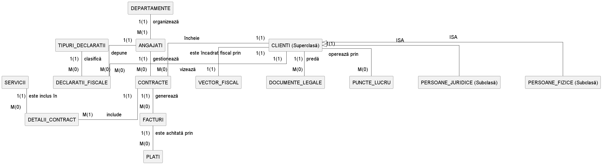
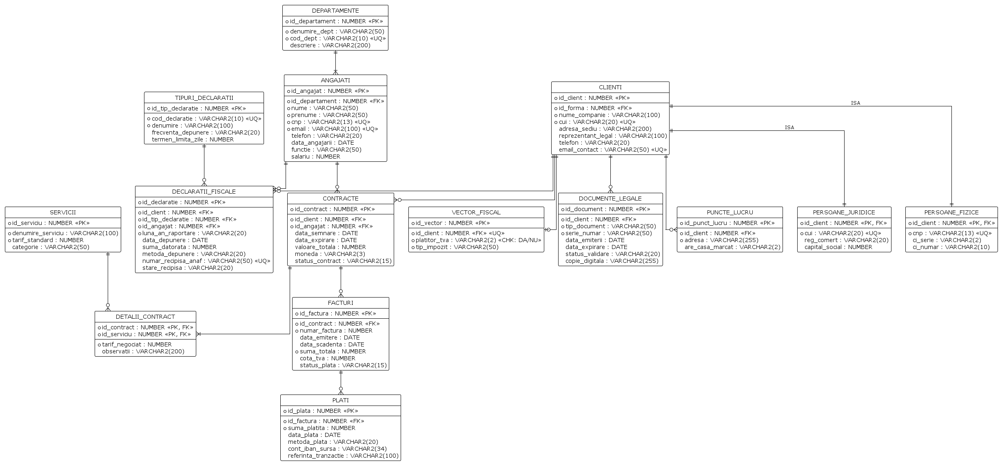

# Proiect Baze de Date: Sistem de Gestiune pentru o Firmă de Contabilitate

Acest proiect modelează un sistem informațional dedicat unui cabinet de expertiză contabilă sau unei firme de contabilitate, realizat pentru cursul de Baze de Date.

## 1. Descrierea modelului real, a utilității acestuia și a regulilor de funcționare

**Descrierea și utilitatea modelului**

* Scopul principal al aplicației este de a digitaliza și centraliza operațiunile zilnice ale unei firme de contabilitate. Din punct de vedere al utilității, sistemul oferă un mediu securizat și organizat pentru gestionarea portofoliului de clienți, a contractelor de prestări servicii, a facturării și, foarte important, a trasabilității declarațiilor fiscale depuse la autorități (ANAF).

**Reguli generale de funcționare**

* **Angajații** (contabili, experți, inspectori de resurse umane) sunt organizați în departamente și sunt responsabili de gestionarea relației cu clienții.
* **Clienții** firmei pot fi atât persoane juridice (companii), cât și persoane fizice (ex. PFA-uri, persoane cu venituri independente). Ei încheie contracte de prestări servicii cu firma de contabilitate.
* **Contractele** includ o serie de servicii contabile specifice (ex. contabilitate primară, salarizare, consultanță), fiecare contract generând ulterior facturi ce trebuie achitate prin diverse plăți.
* Contabilii întocmesc și depun **declarații fiscale** periodice pentru clienți, sistemul urmărind statusul acestora și recipisele justificative. De asemenea, clienții au asociat un vector fiscal și diverse documente sau puncte de lucru care trebuie evidențiate legal.

---

## 2. Prezentarea constrângerilor (restricții, reguli) impuse asupra modelului

Pentru a menține corectitudinea și integritatea bazei de date, modelul respectă următoarele constrângeri stricte de business și tehnice:

* **Ierarhie și moștenire (ISA):** Un client trebuie să fie obligatoriu ori o persoană juridică, ori o persoană fizică. Entitățile derivate rețin atribute specifice (CUI, Registrul Comerțului, Capital Social pentru firme, respectiv CNP, Serie și Număr CI pentru persoanele fizice).
* **Unicitatea datelor:** Angajații se identifică unic pe baza CNP-ului și a adresei de email (`«UQ»`). În mod similar, codul și denumirea departamentelor, adresa de email a clienților și numărul recipisei ANAF pentru o declarație fiscală sunt unice în sistem pentru a preveni duplicarea.
* **Relație 1:1:** O companie (client) este încadrată fiscal printr-un singur **Vector Fiscal**, constrângere implementată prin setarea cheii externe `id_client` din tabelul `VECTOR_FISCAL` ca fiind unică (`«UQ»`).
* **Constrângeri de tip CHECK:** În tabelul `VECTOR_FISCAL`, câmpul `platitor_tva` acceptă doar valori specifice (ex. 'DA' sau 'NU').
* **Relații Many-to-Many rezolvate:** Un contract poate include mai multe servicii, iar un serviciu (ex. "Audit financiar") poate fi inclus în mai multe contracte. Această regulă este implementată prin tabelul asociativ `DETALII_CONTRACT`.
* **Integritate structurală:** O factură nu poate exista fără a fi asociată unui contract valid. La rândul ei, o plată se înregistrează doar pe baza unei facturi emise anterior. O declarație fiscală trebuie să fie clasificată printr-un tip de declarație predefinit (ex. D112, D300).

---

## 3. Diagrama ERD (Entity-Relationship Diagram)

---

## 4. Diagrama Conceptuală (Modelul Relațional)

